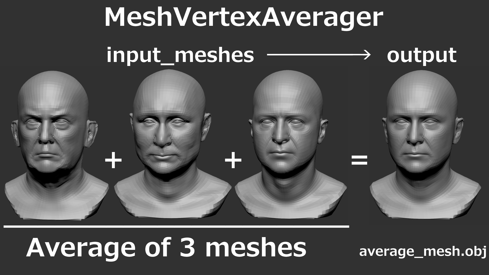
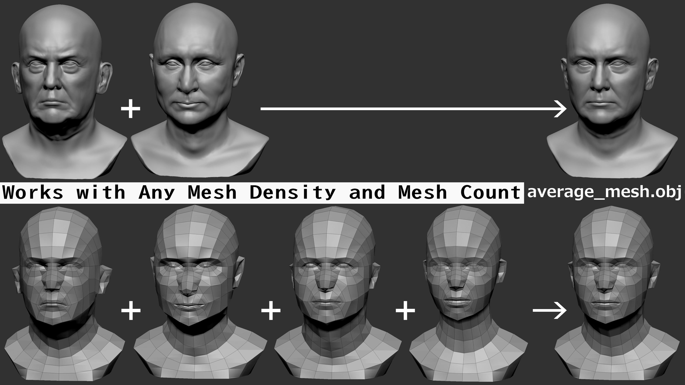

# MeshVertexAverager

MeshVertexAverager is a lightweight Python tool for averaging vertex positions across multiple OBJ meshes that share identical topology and vertex order.

Although originally developed for creating average human faces, it can be used with any mesh dataset that shares the same topology.



The example above averages three meshes.

MeshVertexAverager can process any number of meshes, limited only by available system memory.

Version 1.1.0 preserves original quad polygons and n-gons without automatic triangulation.

---

## Works with Any Mesh Density and Mesh Count



MeshVertexAverager works with both low-poly and high-poly meshes.

The number of input meshes is not fixed.

The examples above use 2 and 4 meshes, but MeshVertexAverager can average any number of meshes, limited only by available system memory.

All input meshes must share identical topology and vertex order.

---

## Features

- Average multiple OBJ meshes
- Preserve topology
- Preserve vertex order
- Preserve quad polygons
- Preserve n-gons
- No automatic triangulation
- Supports low-poly meshes
- Supports high-poly meshes
- Supports averaging any number of meshes (memory-limited)
- Suitable for average face generation

---

## New in v1.1.0

- Preserves original face definitions
- Preserves quad polygons
- Preserves n-gons
- Removes automatic triangulation during export
- Outputs meshes using the original polygon structure

---

## Requirements

- Python 3.10 or newer
- NumPy

Install dependency:

```bash
pip install numpy
```

---

## Installation

Clone the repository:

```bash
git clone https://github.com/shimazakyo-sys/MeshVertexAverager.git
cd MeshVertexAverager
```

Install dependency:

```bash
pip install numpy
```

---

## Directory Structure

```text
MeshVertexAverager/
├── examples/
├── images/
├── input_meshes/
├── output/
├── average_mesh.py
├── README.md
├── LICENSE
└── requirements.txt
```

---

## Usage

Place your OBJ files into:

```text
input_meshes/
```

Run:

```bash
python average_mesh.py
```

The averaged mesh will be generated in:

```text
output/
```

as:

```text
average_mesh.obj
```

---

## Input Requirements

All meshes must:

- Be OBJ format
- Have identical topology
- Have identical vertex count
- Have identical vertex order

MeshVertexAverager verifies that face definitions are identical before averaging.

---

## How It Works

The tool:

1. Reads all OBJ vertex positions.
2. Verifies that all meshes share the same topology.
3. Averages corresponding vertex coordinates.
4. Writes a new OBJ mesh.
5. Preserves the original face definitions from the source mesh.

This means quad polygons and n-gons are preserved exactly as they appear in the original mesh.

---

## Example Use Cases

- Average face generation
- Morph target creation
- Character mesh analysis
- Statistical shape modelling
- Research involving topology-identical meshes

---

## Current Limitations

Current version supports:

- OBJ input
- OBJ output

Input meshes must already be aligned and topology-compatible.

MeshVertexAverager does not perform:

- Mesh registration
- Retopology
- Vertex correspondence estimation

---

## License

MIT License